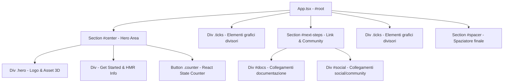

# Documentazione Struttura e Stili Progetto Stitch (ID: 9420641845468785817)

Questo documento descrive in dettaglio la struttura dei componenti, il layout e le specifiche CSS del prototipo generato tramite Google Stitch (ID: `9420641845468785817`). Il codice originale è stato estratto ed analizzato per essere integrato all'interno del progetto **FounDreams**.

---

## 1. Architettura dei Componenti

Il prototipo è una landing page strutturata come Single Page Application in React, con una gerarchia verticale divisa in tre sezioni principali:



---

## 2. Layout Semantico ed Elementi HTML

### Sezione 1: Hero & Counter (`#center`)
Posizionata al centro della viewport, ospita la presentazione del framework e il componente interattivo dello stato React.
*   **Contenitore principale**: `<section id="center">` (Flexbox verticale, allineamento al centro, gap di `25px`).
*   **Elemento `.hero`**: Contiene tre immagini sovrapposte con posizionamento relativo/assoluto per creare un effetto prospettico 3D:
    *   `img.base` (`hero.png`): Immagine di sfondo statica (larghezza `170px`).
    *   `img.framework` (`react.svg`): Icona di React ruotata in 3D tramite trasformazioni prospettiche CSS.
    *   `img.vite` (`vite.svg`): Icona di Vite posizionata sotto la base con trasformazione 3D contraria.
*   **Info Box**: Un `div` contenente un titolo `<h1>` ("Get started") ed un paragrafo con tag `<code>` per indicare la locazione del file sorgente da modificare.
*   **Bottone `.counter`**: Un elemento `<button>` interattivo che gestisce lo stato del contatore React (`count`).

### Elementi Divisori (`.ticks`)
*   `div.ticks`: Divisori geometrici a riga orizzontale con decorazioni triangolari alle estremità, realizzati tramite pseudo-elementi `::before` e `::after` e bordi CSS colorati.

### Sezione 2: Link di Approfondimento (`#next-steps`)
Layout a colonne affiancate su desktop, responsive a scorrimento verticale su mobile.
*   **Contenitore principale**: `<section id="next-steps">` (Flexbox orizzontale, bordo superiore di `1px` solido).
*   **Colonna Documentazione (`#docs`)**:
    *   Icona SVG di presentazione.
    *   Titolo `<h2>` ("Documentation").
    *   Paragrafo descrittivo.
    *   Lista `<ul>` di link per approfondimenti su Vite e React.
*   **Colonna Social (`#social`)**:
    *   Icona SVG di presentazione.
    *   Titolo `<h2>` ("Connect with us").
    *   Paragrafo descrittivo.
    *   Lista `<ul>` di link diretti a repository GitHub, server Discord, canale X.com e pagina Bluesky.

---

## 3. Design System & CSS Tokens

La pagina implementa un sistema di design fluido che supporta nativamente il tema chiaro e il tema scuro tramite variabili CSS (`custom properties`) all'interno di `:root`.

### Palette Colori (Light / Dark Mode)

| Variabile CSS | Colore Tema Chiaro (Light) | Colore Tema Scuro (Dark) | Utilizzo |
| :--- | :--- | :--- | :--- |
| `--bg` | `#ffffff` | `#16171d` | Sfondo principale della pagina |
| `--text` | `#6b6375` | `#9ca3af` | Testo del corpo del testo e paragrafi |
| `--text-h` | `#08060d` | `#f3f4f6` | Colore dei titoli (`h1`, `h2`) e bottoni |
| `--border` | `#e5e4e7` | `#2e303a` | Bordi di separazione e linee ticks |
| `--accent` | `#aa3bff` | `#c084fc` | Colore primario (bottoni e link hover) |
| `--accent-bg` | `rgba(170, 59, 255, 0.1)` | `rgba(192, 132, 252, 0.15)` | Sfondo del bottone contatore |
| `--code-bg` | `#f4f3ec` | `#1f2028` | Sfondo per elementi `code` |
| `--social-bg` | `rgba(244, 243, 236, 0.5)` | `rgba(47, 48, 58, 0.5)` | Sfondo dei bottoni social e doc |

### Tipografia & Font

*   **Font Sans-Serif (Corpo)**: `system-ui, 'Segoe UI', Roboto, sans-serif` (Caricato su `--sans`, dimensione base `18px` desktop / `16px` mobile, altezza riga `145%`).
*   **Font Heading (Titoli)**: Stessa famiglia del Sans-Serif (Caricato su `--heading`, peso `500`).
*   **Font Monospaced (Codice)**: `ui-monospace, Consolas, monospace` (Caricato su `--mono`, dimensione base `15px`).
*   **Titolo `<h1>`**: Dimensione `56px` desktop / `36px` mobile, con `letter-spacing: -1.68px`.
*   **Titolo `<h2>`**: Dimensione `24px` desktop / `20px` mobile, altezza riga `118%`, con `letter-spacing: -0.24px`.

### Effetti Grafici Avanzati (3D Hero CSS)

Le trasformazioni 3D del logo Hero sono applicate in CSS tramite proiezioni prospettiche:
```css
/* Rotazione icona React */
.hero .framework {
  transform: perspective(2000px) rotateZ(300deg) rotateX(44deg) rotateY(39deg) scale(1.4);
}

/* Rotazione icona Vite */
.hero .vite {
  transform: perspective(2000px) rotateZ(300deg) rotateX(40deg) rotateY(39deg) scale(0.8);
}
```

---

## 4. Risorse Associate

I file sorgente estratti sono stati organizzati nella cartella `/leandig_page` all'interno dell'area di lavoro:
*   **Documentazione Strutturale**: `progetto_stitch.md` (Questo file).
*   **Foglio di Stile Consolidato**: `style.css` (Contiene l'unione ottimizzata di `index.css` e `App.css`).
