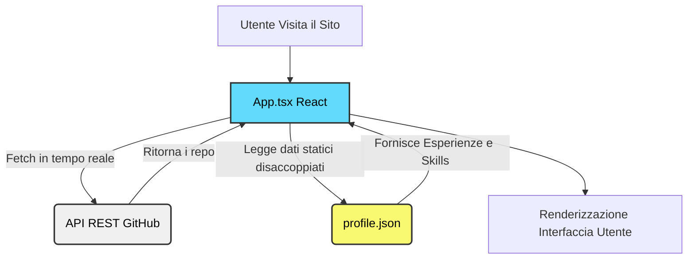
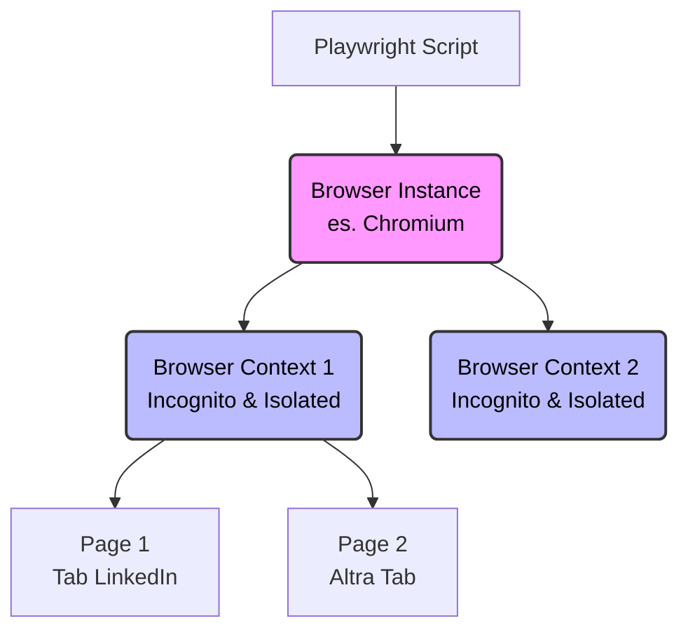
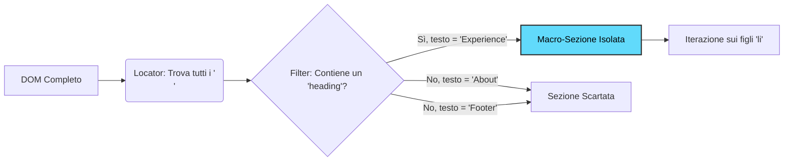
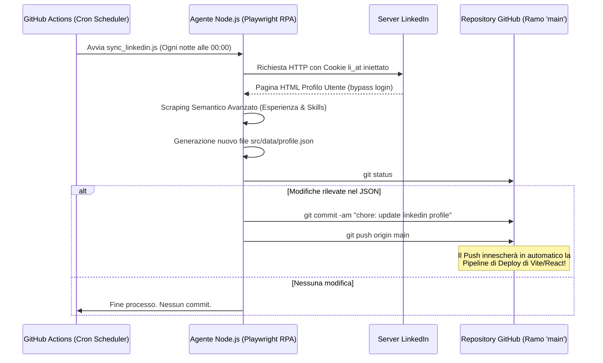
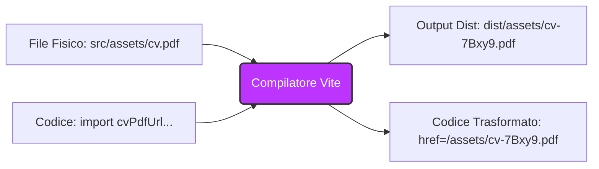
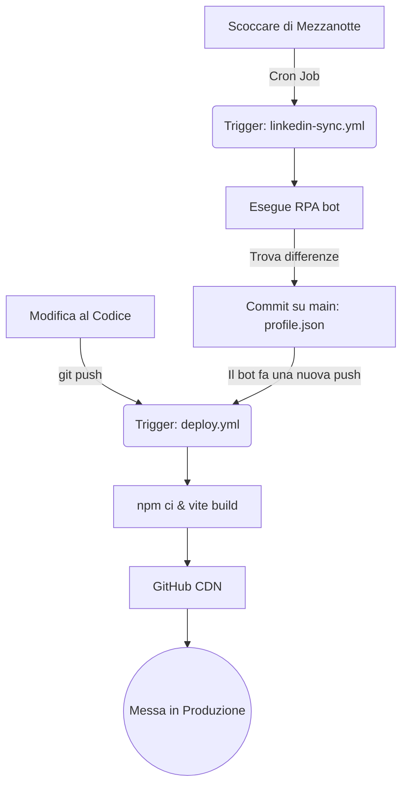

# 📘 Architettura, Sviluppo e Troubleshooting di un Portfolio DevOps-Ready
**Dispensa Didattica a cura del Docente di Sviluppo Cloud & Security**
*Corso: ITS Cloud & Security / Web Engineering*

---

## Indice
1. [Introduzione: La Filosofia del Progetto](#1-introduzione-la-filosofia-del-progetto)
2. [Architettura Dati: Il Decoupling](#2-architettura-dati-il-decoupling-disaccoppiamento)
3. [L'Integrazione RPA: Un Bot che legge LinkedIn](#3-lintegrazione-rpa-un-bot-che-legge-linkedin)
4. [Storie dalla Trincea: Troubleshooting Estremo](#4-storie-dalla-trincea-troubleshooting-estremo)
5. [La Continuous Integration / Deployment (CI/CD)](#5-la-continuous-integration--deployment-cicd)
6. [Conclusione](#6-conclusione)
7. [Wiki & Glossario dei Termini](#7-wiki--glossario-dei-termini)

---

## 1. Introduzione: La Filosofia del Progetto

Cari studenti, oggi analizziamo passo dopo passo la creazione e l'evoluzione di una Landing Page professionale. Non stiamo parlando di un semplice sitarello statico. L'obiettivo ingegneristico che ci siamo posti è stato quello di prendere un design visivo (estratto inizialmente da un tool UI/UX chiamato Stitch) e convertirlo in una **Single Page Application (SPA) reattiva, modulare, auto-aggiornante e pronta per la produzione (DevOps-Ready)**.

**Lo Stack Tecnologico scelto:**
- **React 19 & Vite 8:** Per avere tempi di build istantanei e un Virtual DOM ultra-performante.
- **Tailwind CSS v4:** Per un Design System scalabile direttamente nel codice, eliminando la manutenzione di noiosi file `.css` separati.
- **Node.js & Playwright:** Per iniettare logiche di Robotic Process Automation (RPA).
- **GitHub Actions:** Per la Continuous Integration / Continuous Deployment (CI/CD).

Se pensate che sviluppare front-end sia solo "mettere i colori giusti", vi sbagliate di grosso. L'ingegneria del software web richiede rigore sistemistico, e in questo documento vedremo esattamente perché.

---

## 2. Architettura Dati: Il Decoupling (Disaccoppiamento)

Una delle regole auree dello sviluppo software è: **"Mai cablare i dati direttamente nel codice (Hardcoding)"**. 

All'inizio, il nostro file `App.tsx` conteneva tutte le esperienze lavorative e le "Skills" scritte direttamente nei tag HTML. Questo è il male assoluto per un sistemista: ogni volta che l'utente (Gabriele) cambia lavoro, dovrebbe ricompilare il codice React. 

**La Soluzione Ingegneristica:**
Abbiamo creato una cartella `src/data/` e un file `profile.json`. 
Abbiamo poi modificato `App.tsx` per mappare (usando la funzione `.map()` di Javascript) quel JSON in componenti visivi.
Questo disaccoppiamento non solo pulisce il codice, ma crea un "Data Layer" che apre la strada alla nostra automazione più potente: l'RPA.



### Fetching Dinamico (Progetti GitHub)
Invece di scrivere a mano i progetti, abbiamo usato gli hook di React (`useState` e `useEffect`) per lanciare una chiamata API REST a GitHub:
```javascript
fetch('https://api.github.com/users/SandMan00001/repos?sort=updated&per_page=6')
```
Questo rende la sezione "Progetti" un riflesso in tempo reale dell'attività open-source dello sviluppatore.

---

## 3. L'Integrazione RPA (Robotic Process Automation): La Masterclass Definitiva

Cari studenti, se c'è un argomento in questo corso che vi permetterà di fare la differenza nel mondo reale, è questo. Immaginate l'RPA (Robotic Process Automation) non solo come uno script, ma come un "impiegato virtuale" che istruite per fare esattamente le operazioni umane che fareste voi col mouse e con la tastiera, ma a velocità disarmanti.

Abbiamo affrontato una sfida complessa e comunissima nelle aziende: **"Voglio che il mio sito si aggiorni automaticamente quando aggiorno il mio profilo LinkedIn"**.
LinkedIn, come molti colossi, non possiede un'API pubblica, gratuita e aperta per estrarre liberamente i dati dei profili. Protegge i suoi dati con le unghie e con i denti. Come DevOps e Web Engineers, non ci arrendiamo davanti a un "non si può fare": creiamo un workaround ingegneristico.

Abbiamo scritto un agente Node.js (`rpa_agent/sync_linkedin.js`) utilizzando **Playwright** (un framework di browser automation open-source creato da Microsoft). 
In questa sezione, sviscereremo ogni singolo aspetto della creazione di questo agente RPA, affinché alla fine della lettura siate in grado di progettare, sviluppare e mettere in produzione i vostri bot autonomamente.

### 3.1. La Scelta del Framework: Perché Playwright?

Prima di scrivere codice, dovete conoscere gli strumenti. Storicamente, l'RPA web si faceva con **Selenium** (lento, macchinoso, basato su driver esterni) o con **Puppeteer** (creato da Google, molto buono ma legato quasi esclusivamente a Chrome/Chromium).
Abbiamo scelto **Playwright** per motivi ben precisi:
1. **Auto-waiting:** Non dovete più scrivere `sleep(5000)` sperando che la pagina carichi. Playwright aspetta automaticamente che gli elementi siano visibili, stabili e cliccabili prima di interagire. Questo elimina il 90% degli errori di "elemento non trovato".
2. **Context Isolation:** Playwright può creare "Contesti di navigazione" (`BrowserContext`), che sono letteralmente sessioni in incognito super leggere che non condividono cookie o cache tra loro.
3. **Cross-browser:** Gira su Chromium, WebKit (Safari) e Firefox con la stessa identica API.

Per iniziare un progetto RPA, vi basta lanciare:
```bash
npm init -y
npm install playwright
```

### 3.2. Inizializzazione e Architettura del Bot

Ogni bot RPA su Playwright segue questa architettura a matrioska: `Browser` ➔ `Context` ➔ `Page`.



```javascript
const { chromium } = require('playwright');

(async () => {
  // 1. Lanciamo il browser (spesso in modalità 'headless', senza interfaccia visibile)
  const browser = await chromium.launch({ headless: true });
  
  // 2. Creiamo un contesto isolato
  const context = await browser.newContext();
  
  // 3. Apriamo una nuova scheda (Page)
  const page = await context.newPage();
  
  await page.goto('https://www.linkedin.com/in/iltuoprofilo/');
  
  // ... qui va la logica ...

  await browser.close();
})();
```
Questa è l'ossatura. Ma se lanciate questo script su LinkedIn, verrete bloccati istantaneamente da un Captcha o dal form di Login. I sistemi moderni riconoscono i bot "vergini".

### 3.3. Gestione Anti-Bot e Sessioni Autenticate (Bypassare i Captcha)

L'errore numero uno di chi inizia con l'RPA è cercare di far riempire al bot il modulo di login (username e password) ad ogni esecuzione. **Non fatelo mai.** Sarete identificati come bot al secondo tentativo.

**La Soluzione Professionale: L'Iniezione dei Cookie.**
Quando voi vi loggate normalmente su LinkedIn col vostro Chrome, LinkedIn vi lascia un biscottino (Cookie) chiamato `li_at` (LinkedIn Auth Token) che scade dopo molto tempo (es. un anno). Questo token dice ai server: "Sono io, non chiedermi più la password".

Il nostro bot RPA **ruba** questa identità. 
1. Voi aprite il vostro browser, andate su LinkedIn, aprite gli Strumenti per Sviluppatori (F12) ➔ Applicazione ➔ Cookie.
2. Copiate il valore lunghissimo del cookie `li_at`.
3. Lo salvate nei segreti del vostro server o su GitHub Actions come variabile d'ambiente (es. `LINKEDIN_LI_AT_COOKIE`).

Nel codice, prima ancora di navigare sulla pagina, iniettiamo il cookie nel Contesto (Context):

```mermaid
flowchart LR
    A[RPA Bot] --"Navigazione standard"--> B(Pagina di Login)
    B --"Tentativo di login automatico"--> C{Sistemi Anti-Bot}
    C --"Rilevato bot"--> D[CAPTCHA / Accesso Negato]
    
    E[RPA Bot] --"Iniezione Cookie 'li_at'"--> F(Server LinkedIn)
    F --"Sessione Esistente Riconosciuta"--> G[Profilo Accessibile (Bypass)]
    
    style D fill:#ffcccc,stroke:#ff0000,stroke-width:2px,color:#000
    style G fill:#ccffcc,stroke:#008000,stroke-width:2px,color:#000
```

```javascript
await context.addCookies([
  {
    name: 'li_at',
    value: process.env.LINKEDIN_LI_AT_COOKIE, // Prelevato in modo sicuro
    domain: '.linkedin.com',
    path: '/'
  }
]);

// Ora, quando visitiamo la pagina, LinkedIn ci tratterà come l'utente loggato!
await page.goto('https://www.linkedin.com/in/sandman00001/');
```
Con questo trucco, abbiamo completamente bypassato il login e tutti i sistemi anti-bot iniziali. Il server si finge un browser già autenticato da mesi.

### 3.4. La Rivoluzione dello Scraping Semantico (Locators Avanzati)

Siete dentro la pagina. Ora dovete estrarre l'elenco delle esperienze lavorative.
Molti sviluppatori alle prime armi (e molti vecchi tutorial online) userebbero i selettori CSS:
```javascript
// APPROCCIO SBAGLIATO (FRAGILE)
const esperienze = await page.$$('.pvs-list__item--line-separated');
```
I grandi siti web usano classi autogenerate che cambiano ad ogni deploy di produzione (spesso ogni settimana). Se scrivete il bot così, si romperà domani e dovrete passare la vita a fare manutenzione.

La vera masterclass è usare l'**Approccio Semantico (Locators by Role)**.
Noi non diciamo al bot *"Cerca la classe `.abc-123`"*, ma diciamo *"Guarda la pagina come farebbe una persona non vedente usando lo screen reader. Trova un titolo generico che si chiami 'Esperienza' e dammi il suo blocco padre"*.

Guardate la potenza di questo Locator di Playwright:
```javascript
// APPROCCIO PROFESSIONALE (RESILIENTE)
const experienceSection = page
  .locator('section')
  .filter({ has: page.getByRole('heading', { name: /Experience|Esperienza/i }) });
```



**Analizziamo questo gioiello ingegneristico (con parole semplicissime):**
Immaginate di mandare un robottino cieco in una grandissima biblioteca (la pagina di LinkedIn) a cercare il reparto delle vostre vite lavorative.
1. `page.locator('section')`: Il robottino tasta i muri e individua tutti gli scaffali enormi della libreria (le macro-aree o "section").
2. `.filter({ has: ... })`: Non avendo tempo di guardare ogni singolo libro, il robottino decide di scartare gli scaffali che non gli interessano. Li "filtra" tenendo solo quelli che rispettano una condizione.
3. `page.getByRole('heading', { name: /Experience|Esperienza/i })`: Qual è la condizione? Cerca, passandoci il dito sopra, un cartellone principale (un'intestazione o "heading") che contiene scolpita esattamente la parola "Experience" o "Esperienza". 

Se LinkedIn domani decide di dipingere gli scaffali di rosso, cambiargli la forma o usare nuovi codici identificativi invisibili (le classi CSS), il nostro bot non si farà fregare: continuerà a trovare lo scaffale giusto semplicemente "tastando" e cercando il cartellone col titolo corretto. Questo rende il codice quasi indistruttibile!

### 3.5. Estrazione e Trasformazione Dati (Parsing e Iterazione)

Immaginate che la pagina web sia una gigantesca matrioska piena di scatoline più piccole. Una volta che abbiamo trovato lo scatolone grande delle esperienze lavorative (`experienceSection`), dobbiamo aprirlo e tirare fuori, una ad una, tutte le singole esperienze. 

In termini tecnici, dobbiamo "iterare" (scorrere ciclicamente) su una lista di elementi. In Playwright, per estrarre tutti gli elementi simili si usa il comando `.all()`. 

Ma c'è un concetto tecnico fondamentale e bellissimo che dovete capire qui: **il divario tra due mondi**.
Pensate al vostro script Node.js come a un **pilota bendato** chiuso in una torre di controllo, e al Browser come a un **esploratore** sul campo. Il pilota non può "toccare" o leggere direttamente il testo sulla pagina web. Deve usare una radiotrasmittente (il comando `.evaluate()`) per dire all'esploratore: *"Ehi, guarda l'elemento che hai davanti, leggi ad alta voce le parole scritte dentro e dimmele!"*.

Ecco come il pilota guida l'esploratore nel codice:

```javascript
// Cerchiamo le singole voci della lista lavorativa all'interno della sezione che abbiamo isolato
const jobCards = await experienceSection.locator('ul > li').all();
const risultati = [];

for (const card of jobCards) {
  // L'evaluate ci permette di eseguire una funzione JavaScript direttamente dentro il browser
  const jobTitle = await card.locator('.t-bold span').first().evaluate(el => el.innerText);
  const companyName = await card.locator('.t-normal span').first().evaluate(el => el.innerText);
  
  risultati.push({
    titolo: jobTitle.trim(),
    azienda: companyName.trim()
  });
}
```

**Semplifichiamo questo codice passo-passo, come se lo spiegassimo a un bambino:**

1. **`locator('ul > li').all()`**: È come dire al robot: *"Guarda dentro lo scatolone dell'Esperienza. Lì dentro c'è una lista (`ul`) piena di tanti foglietti (`li`). Prendili tutti e mettili in una cartellina chiamata `jobCards`"*.
2. **`for (const card of jobCards)`**: Il robot prende la sua cartellina, tira fuori un foglietto alla volta e compie su di esso le operazioni successive.
3. **`locator('.t-bold span').first()`**: Il robot prende una lente di ingrandimento e cerca, isolatamente su quel singolo foglietto, la primissima scritta in grassetto (che su LinkedIn, visivamente, corrisponde al titolo del ruolo lavorativo, es. *Software Engineer*).
4. **`evaluate(el => el.innerText)`**: Qui si accende la radiotrasmittente magica! Il robot di Node.js invia un impulso al cervello del browser chiedendogli: *"Prendi questo elemento visivo (`el`), estrai unicamente il testo puro e leggibile da un essere umano (`innerText`), e spediscimelo indietro tramite la radio"*.
5. **`risultati.push(...)`**: Terminata la lettura, il robot prende la sua penna e trascrive i testi estratti in un taccuino super ordinato (il nostro Oggetto/Array JSON finale), avendo cura di tagliare via eventuali spazi vuoti accidentali ai bordi delle parole usando il temperino `.trim()`.

L'uso oculato dei `locator` concatenati funziona esattamente come un imbuto: stringe progressivamente il raggio di ricerca (partendo dallo scatolone gigante `section`, passando per la lista `li`, fino ad arrivare alla minuscola scritta nello `span`). Trasforma così la complessa grafica di un sito web in una tabella di dati ordinata e pulita, pronta per essere usata dalla nostra web app!

### 3.6. Il Flusso Completo CI/CD: Dall'Agente alla Produzione

Ora avete un bot perfetto sulla vostra macchina. Ma un RPA non ha senso se dovete lanciarlo voi a mano. Il nostro traguardo finale è l'automazione DevOps totale tramite **GitHub Actions**.

Abbiamo inserito nel nostro repository un file `.github/workflows/linkedin-sync.yml`. Questo file definisce una Pipeline di Continuous Integration:
1. Imposta un timer (**Cron Job**): `0 0 * * *` (esegui ogni notte a mezzanotte).
2. Tira su un mini-server Linux effimero su cloud.
3. Clona il nostro codice (checkout).
4. Installa Node.js e Playwright (`npx playwright install chromium`).
5. Esegue il nostro bot RPA passandogli il cookie segreto dalle impostazioni segrete di GitHub (`LINKEDIN_LI_AT_COOKIE`).
6. Il bot estrae i dati e salva (sovrascrive) fisicamente il file `src/data/profile.json`.

**Il colpo di genio dell'auto-commit:**
Se il bot capisce che non ci sono stati cambiamenti (il JSON è identico a ieri), il processo si ferma in pace. 
Se invece avete cambiato lavoro su LinkedIn, il bot genera un JSON diverso. La pipeline esegue un comando `git status`. Notando una differenza nel file `profile.json`, la pipeline esegue da sola un nuovo **Commit** firmato da "GitHub Actions Bot" e fa il push sul ramo `main`!



In quel preciso istante, il nuovo "push" automatico innesca la seconda pipeline (quella dedicata a Vite/React), che ricompilerà il sito statico col nuovo JSON e pubblicherà la landing page aggiornata.
Tutto questo accade mentre voi state tranquillamente dormendo.

**Questo è il livello di automazione che si aspetta l'industria moderna.** Saper integrare scraping avanzato, autenticazione shadow tramite cookie, manipolazione dei dati JSON e orchestrazione pipeline su GitHub Actions vi trasforma da semplici "sviluppatori web" a veri "Cloud & Automation Engineers".

---

## 4. Storie dalla Trincea: Troubleshooting Estremo

Durante lo sviluppo in aula (e in produzione!) abbiamo incontrato 4 grossi problemi. Ecco come ci siamo arrivati e come li abbiamo smontati analiticamente.

### Caso A: L'Errore Severo di TypeScript (`TS6133`)
Durante il primo caricamento su GitHub Actions, la pipeline si è fermata (Exit code 2) con questo errore:
`Error: src/App.tsx(1,8): error TS6133: 'React' is declared but its value is never read.`

**Diagnosi:** 
I linter moderni e il compilatore TypeScript (`tsc -b`) sono configurati per non ammettere spazzatura. Se dichiari una variabile e non la usi, la build fallisce. In passato, per usare JSX (`<div/>`) dovevi importare l'intero oggetto `React`. Dalla versione React 17 in poi, esiste un *JSX Transform* interno. L'import `import React from 'react';` era obsoleto.
**Soluzione:** Rimozione dell'import. Pipeline sbloccata.

### Caso B: La "Pagina Bianca del Terrore" su GitHub Pages (Errore 404 Assets)
Dopo il deploy, il sito caricava una pagina immacolata. Niente errori a schermo. 
Analizzando la rete (F12) abbiamo notato che l'HTML veniva caricato, ma i file Javascript e CSS davano errore `404 Not Found`.

**Diagnosi:**
Vite usa il parametro `base` nel file `vite.config.ts` per scrivere i percorsi nel file `index.html`. Inizialmente avevamo `base: '/leanding_page/'`. 
Questo diceva al browser: *"Ehi, per trovare il JS, vai su `italiasaija.it/leanding_page/assets/file.js`"*. 
Ma lo studente aveva configurato un file `CNAME` (Custom Domain). Questo significa che GitHub Pages stava servendo la repository dalla *radice* del dominio `italiasaija.it`, non da una sottocartella! Il browser cercava in una cartella inesistente.
**Soluzione:** 
Abbiamo impostato `base: './'`. Usare il percorso relativo *puntato* (`./`) è la panacea per quasi tutti i mali di deployment statico. Dice al browser di cercare gli asset *nella stessa esatta cartella* in cui ha trovato l'HTML. Fine dei 404.

### Caso C: Il "Mistero del CV Scomparso"
Il sito in locale funzionava, il tasto "Scarica CV" scaricava il file. In produzione (su GitHub), cliccando il tasto si veniva portati in un buco nero (404).

**Diagnosi e Soluzione (L'approccio Bulletproof di Vite):**
Il tasto era originariamente codificato così: `<a href="./cv.pdf">`. Affidarsi a una stringa hardcodata per le dipendenze statiche è rischioso. In produzione, complici i redirect del custom domain, il browser ha perso il riferimento relativo e tentava di cercare il PDF in directory errate.

Abbiamo preso il file e lo abbiamo spostato dentro il codice sorgente: `src/assets/cv.pdf`.
Poi, abbiamo esplicitamente informato il compilatore della sua esistenza: 
`import cvPdfUrl from './assets/cv.pdf';`


In questo modo, Vite non è più passivo. Prende il file, lo inserisce nella build sicura, genera un nome con un Hash univoco e inietta il percorso esatto al 100%. Il link non può più rompersi. È una lezione vitale sulla differenza tra *riferimento testuale* e *modulo importato*.

### Caso D: L'Hamburger Menu Paralizzato
Lo studente fa notare: "Da smartphone le 3 lineette non vanno".
Il Mockup originale HTML aveva un bottone statico. In React, il DOM statico non si auto-aggiorna da solo senza una logica esplicita.

**Diagnosi e Soluzione:**
Abbiamo introdotto l'hook `useState(false)`. Il bottone è diventato reattivo, cambiando persino l'icona (da Menu a Close) tramite un operatore ternario. Abbiamo infine wrappato la lista di link mobile dentro una valutazione logica: `{isMobileMenuOpen && ( <div... /> )}`. In React, se lo state è `false`, quel frammento di codice letteralmente *smette di esistere* nel Virtual DOM, senza pesare sulla RAM del dispositivo.

---

## 5. La Continuous Integration / Deployment (CI/CD)

Il vero DevOps non fa le cose a mano due volte. Abbiamo configurato due pipeline su GitHub Actions, orchestrate per lavorare in totale sintonia:



1. **Pipeline di Deploy (`deploy.yml`)**: Ogni volta che viene fatto un `push` sul ramo `main`, un server avvia `npm ci`, esegue la build di Vite e spara i file compilati ai server CDN di GitHub Pages in automatico.
2. **Pipeline di Sync (`linkedin-sync.yml`)**: Ogni notte a mezzanotte il server lancia il bot RPA. Se estrae dati diversi dal giorno prima, il bot lancia da solo un `git commit` col nuovo `profile.json`. Questo nuovo "push" automatico attiverà la pipeline di Deploy, chiudendo il cerchio senza alcun intervento umano.

Il risultato? Il portfolio è un vero ecosistema vivente, che si mantiene aggiornato mentre lo sviluppatore dorme.

---

## 6. Conclusione

Ragazzi, questa landing page è un capolavoro di orchestrazione. Non guardatela come una vetrina di testo e colori, ma come un assemblaggio di Node.js, automazione browser, build tools avanzati e pipeline cloud. Mantenete sempre la mentalità da ingegneri: scovate il problema nei DevTools, leggete i log della build, disaccoppiate i dati dalla UI e automatizzate tutto il possibile.

Buono studio.

---

## 7. Wiki & Glossario dei Termini

Per assicurarci di parlare tutti la stessa lingua tecnica, ecco il vocabolario fondamentale del progetto:

*   **API REST (Representational State Transfer):** Un'interfaccia di comunicazione standard usata su internet. Nel nostro caso, è il "cameriere" a cui chiediamo i dati di GitHub passandogli l'indirizzo del nostro account e lui ci restituisce un "vassoio" in formato JSON pieno dei nostri progetti.
*   **Base Path (`base` in Vite):** L'indirizzo "radice" da cui un sito web presume di essere eseguito. Fondamentale per dire ai file HTML dove pescare immagini, fogli di stile e script in produzione.
*   **CI/CD (Continuous Integration / Continuous Deployment):** Pratica DevOps che consiste nell'unire spesso il codice modificato in un archivio centrale (CI) e rilasciarlo ai clienti o agli utenti in modo automatico (CD). 
*   **Decoupling (Disaccoppiamento):** Pratica di ingegneria del software che consiste nel separare le logiche e i dati, in modo che l'aggiornamento di una componente non distrugga le altre (es. togliere le "skills" dal file App.tsx e spostarle in profile.json).
*   **DOM (Document Object Model) vs Virtual DOM:** Il DOM è la struttura ad albero HTML di una pagina web usata dai normali browser. Il *Virtual DOM*, usato da React, è una "fotocopia" in memoria di quell'albero. React aggiorna prima la fotocopia, calcola i cambiamenti in modo matematico e poi aggiorna il vero DOM solo dove serve, abbattendo drasticamente i tempi di caricamento.
*   **Hardcoding:** La cattivissima abitudine di "scrivere a mano" dati variabili all'interno del codice sorgente invece di caricarli da un database o da un file esterno.
*   **Hook (`useState`, `useEffect`):** Funzioni speciali in React che ti permettono di "agganciarti" a funzionalità di stato e ciclo di vita. Lo State tiene in memoria qualcosa che cambia (es. il menu mobile aperto), l'Effect si scatena quando qualcosa avviene (es. al caricamento della pagina tira giù i progetti da GitHub).
*   **Linter & Strict Mode:** Strumenti di polizia del codice. Controllano in tempo reale che tu non faccia pasticci, non dichiari variabili morte e che tu stia usando in modo corretto le tipizzazioni TypeScript.
*   **RPA (Robotic Process Automation):** L'uso di software "robotici" o "agenti" programmabili per eseguire in modo automatico compiti ripetitivi basati su interfacce umane. (Il nostro caso: lo script che va su LinkedIn per leggersi le tue posizioni di lavoro).
*   **Scraping Semantico:** Leggere i dati da una pagina web non tramite la posizione esatta di una riga di testo o dal nome di un colore (CSS selector), ma dal *significato* del tag (es. "Cerca un Titolo Principale che dice 'Esperienza' e poi leggi le righe successive").
*   **SPA (Single Page Application):** Un'app web che non ha bisogno di farti cambiare "pagina HTML" ricaricando lo schermo bianco tra un link e l'altro, ma ricarica solo i singoli "blocchi" dinamicamente simulando un software desktop.
