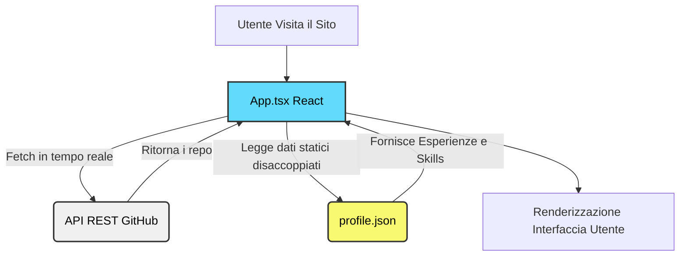
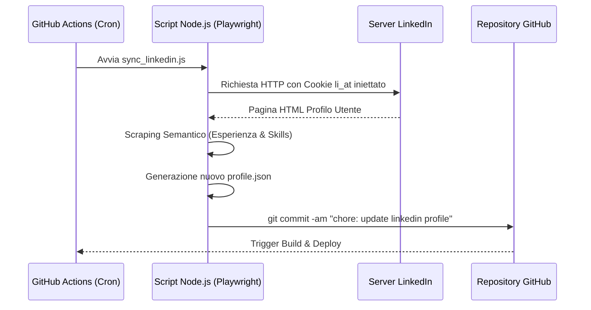
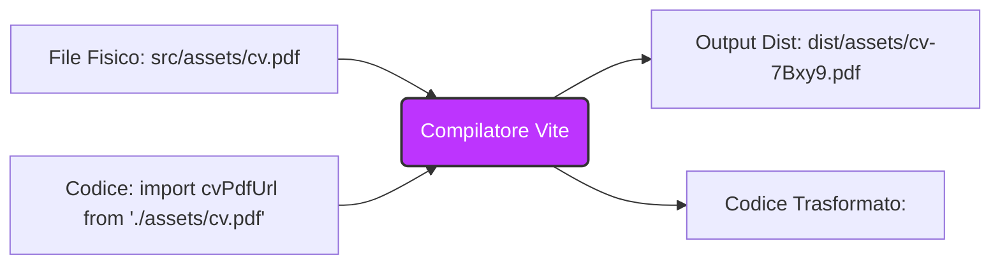
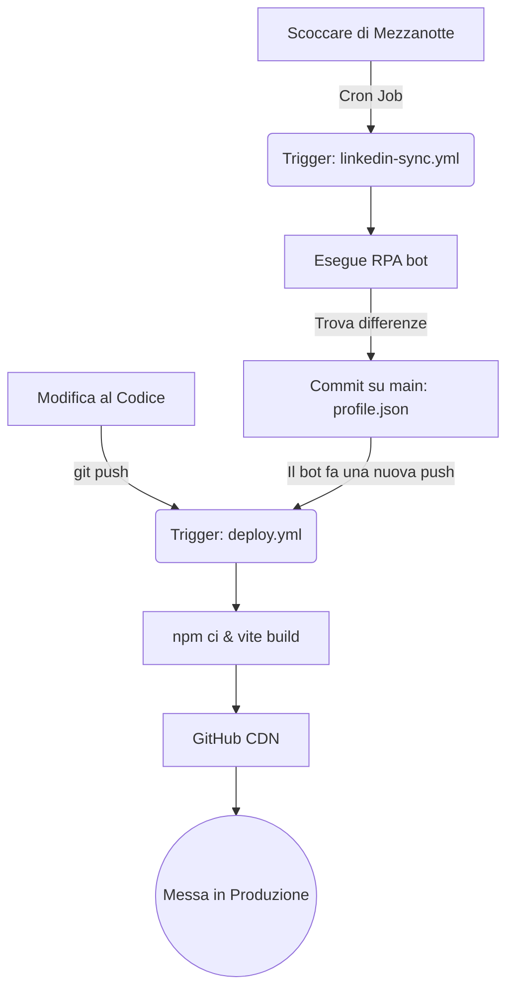

# 📘 Architettura, Sviluppo e Troubleshooting di un Portfolio DevOps-Ready
**Dispensa Didattica a cura del Docente di Sviluppo Cloud & Security**
*Corso: ITS Cloud & Security / Web Engineering*

---

## Indice
1. [Introduzione: La Filosofia del Progetto](#1-introduzione-la-filosofia-del-progetto)
2. [Architettura Dati: Il Decoupling](#2-architettura-dati-il-decoupling-disaccoppiamento)
3. [L'Integrazione RPA: Un Bot che legge LinkedIn](#3-lintegrazione-rpa-un-bot-che-legge-linkedin)
4. [Storie dalla Trincea: Troubleshooting Estremo](#4-storie-dalla-trincea-troubleshooting-estremo)
5. [La Continuous Integration / Deployment (CI/CD)](#5-la-continuous-integration--deployment-cicd)
6. [Conclusione](#6-conclusione)
7. [Wiki & Glossario dei Termini](#7-wiki--glossario-dei-termini)

---

## 1. Introduzione: La Filosofia del Progetto

Cari studenti, oggi analizziamo passo dopo passo la creazione e l'evoluzione di una Landing Page professionale. Non stiamo parlando di un semplice sitarello statico. L'obiettivo ingegneristico che ci siamo posti è stato quello di prendere un design visivo (estratto inizialmente da un tool UI/UX chiamato Stitch) e convertirlo in una **Single Page Application (SPA) reattiva, modulare, auto-aggiornante e pronta per la produzione (DevOps-Ready)**.

**Lo Stack Tecnologico scelto:**
- **React 19 & Vite 8:** Per avere tempi di build istantanei e un Virtual DOM ultra-performante.
- **Tailwind CSS v4:** Per un Design System scalabile direttamente nel codice, eliminando la manutenzione di noiosi file `.css` separati.
- **Node.js & Playwright:** Per iniettare logiche di Robotic Process Automation (RPA).
- **GitHub Actions:** Per la Continuous Integration / Continuous Deployment (CI/CD).

Se pensate che sviluppare front-end sia solo "mettere i colori giusti", vi sbagliate di grosso. L'ingegneria del software web richiede rigore sistemistico, e in questo documento vedremo esattamente perché.

---

## 2. Architettura Dati: Il Decoupling (Disaccoppiamento)

Una delle regole auree dello sviluppo software è: **"Mai cablare i dati direttamente nel codice (Hardcoding)"**. 

All'inizio, il nostro file `App.tsx` conteneva tutte le esperienze lavorative e le "Skills" scritte direttamente nei tag HTML. Questo è il male assoluto per un sistemista: ogni volta che l'utente (Gabriele) cambia lavoro, dovrebbe ricompilare il codice React. 

**La Soluzione Ingegneristica:**
Abbiamo creato una cartella `src/data/` e un file `profile.json`. 
Abbiamo poi modificato `App.tsx` per mappare (usando la funzione `.map()` di Javascript) quel JSON in componenti visivi.
Questo disaccoppiamento non solo pulisce il codice, ma crea un "Data Layer" che apre la strada alla nostra automazione più potente: l'RPA.



### Fetching Dinamico (Progetti GitHub)
Invece di scrivere a mano i progetti, abbiamo usato gli hook di React (`useState` e `useEffect`) per lanciare una chiamata API REST a GitHub:
```javascript
fetch('https://api.github.com/users/SandMan00001/repos?sort=updated&per_page=6')
```
Questo rende la sezione "Progetti" un riflesso in tempo reale dell'attività open-source dello sviluppatore.

---

## 3. L'Integrazione RPA: Un Bot che legge LinkedIn

Abbiamo affrontato una sfida complessa: "Voglio che il mio sito si aggiorni automaticamente quando aggiorno il mio profilo LinkedIn".
LinkedIn non possiede un'API pubblica gratuita per estrarre i dati dei profili. Come DevOps, dovevamo trovare un workaround. 

Abbiamo scritto uno script Node.js (`rpa_agent/sync_linkedin.js`) utilizzando **Playwright** (un framework di browser automation creato da Microsoft).

### Scraping Semantico vs Scraping Classico
Molti sviluppatori alle prime armi userebbero i selettori CSS (es. `.pvs-list__item--line-separated`) per estrarre il testo. Ma i grandi siti come LinkedIn generano queste classi in modo casuale o le cambiano ogni settimana, rompendo l'automazione. 
Noi abbiamo usato un approccio **Semantico**:
```javascript
const experienceSection = page.locator('section').filter({ has: page.getByRole('heading', { name: /Experience|Esperienza/i }) });
```
Abbiamo detto al bot: *"Trova una macro-area (`<section>`) che contenga un titolo (`<h2>`) che suona come 'Esperienza'. E poi leggimi i sotto-elementi (`<li>`)."*
Questo approccio è incredibilmente resiliente ai cambiamenti di design (UI/UX) della piattaforma bersaglio.

### Gestione Anti-Bot e Sessioni
I sistemi moderni riconoscono i bot. Se lanciate Playwright da zero su LinkedIn, vi scontrerete con Captcha impossibili. La nostra soluzione è stata usare un `browserContext` persistente e iniettare i **Cookie di Sessione (`li_at`)** da una variabile d'ambiente (`LINKEDIN_LI_AT_COOKIE`). Il server si finge un browser già autenticato, scarica il JSON, sovrascrive `profile.json` e chiude tutto.



---

## 4. Storie dalla Trincea: Troubleshooting Estremo

Durante lo sviluppo in aula (e in produzione!) abbiamo incontrato 4 grossi problemi. Ecco come ci siamo arrivati e come li abbiamo smontati analiticamente.

### Caso A: L'Errore Severo di TypeScript (`TS6133`)
Durante il primo caricamento su GitHub Actions, la pipeline si è fermata (Exit code 2) con questo errore:
`Error: src/App.tsx(1,8): error TS6133: 'React' is declared but its value is never read.`

**Diagnosi:** 
I linter moderni e il compilatore TypeScript (`tsc -b`) sono configurati per non ammettere spazzatura. Se dichiari una variabile e non la usi, la build fallisce. In passato, per usare JSX (`<div/>`) dovevi importare l'intero oggetto `React`. Dalla versione React 17 in poi, esiste un *JSX Transform* interno. L'import `import React from 'react';` era obsoleto.
**Soluzione:** Rimozione dell'import. Pipeline sbloccata.

### Caso B: La "Pagina Bianca del Terrore" su GitHub Pages (Errore 404 Assets)
Dopo il deploy, il sito caricava una pagina immacolata. Niente errori a schermo. 
Analizzando la rete (F12) abbiamo notato che l'HTML veniva caricato, ma i file Javascript e CSS davano errore `404 Not Found`.

**Diagnosi:**
Vite usa il parametro `base` nel file `vite.config.ts` per scrivere i percorsi nel file `index.html`. Inizialmente avevamo `base: '/leanding_page/'`. 
Questo diceva al browser: *"Ehi, per trovare il JS, vai su `italiasaija.it/leanding_page/assets/file.js`"*. 
Ma lo studente aveva configurato un file `CNAME` (Custom Domain). Questo significa che GitHub Pages stava servendo la repository dalla *radice* del dominio `italiasaija.it`, non da una sottocartella! Il browser cercava in una cartella inesistente.
**Soluzione:** 
Abbiamo impostato `base: './'`. Usare il percorso relativo *puntato* (`./`) è la panacea per quasi tutti i mali di deployment statico. Dice al browser di cercare gli asset *nella stessa esatta cartella* in cui ha trovato l'HTML. Fine dei 404.

### Caso C: Il "Mistero del CV Scomparso"
Il sito in locale funzionava, il tasto "Scarica CV" scaricava il file. In produzione (su GitHub), cliccando il tasto si veniva portati in un buco nero (404).

**Diagnosi e Soluzione (L'approccio Bulletproof di Vite):**
Il tasto era originariamente codificato così: `<a href="./cv.pdf">`. Affidarsi a una stringa hardcodata per le dipendenze statiche è rischioso. In produzione, complici i redirect del custom domain, il browser ha perso il riferimento relativo e tentava di cercare il PDF in directory errate.

Abbiamo preso il file e lo abbiamo spostato dentro il codice sorgente: `src/assets/cv.pdf`.
Poi, abbiamo esplicitamente informato il compilatore della sua esistenza: 
`import cvPdfUrl from './assets/cv.pdf';`


In questo modo, Vite non è più passivo. Prende il file, lo inserisce nella build sicura, genera un nome con un Hash univoco e inietta il percorso esatto al 100%. Il link non può più rompersi. È una lezione vitale sulla differenza tra *riferimento testuale* e *modulo importato*.

### Caso D: L'Hamburger Menu Paralizzato
Lo studente fa notare: "Da smartphone le 3 lineette non vanno".
Il Mockup originale HTML aveva un bottone statico. In React, il DOM statico non si auto-aggiorna da solo senza una logica esplicita.

**Diagnosi e Soluzione:**
Abbiamo introdotto l'hook `useState(false)`. Il bottone è diventato reattivo, cambiando persino l'icona (da Menu a Close) tramite un operatore ternario. Abbiamo infine wrappato la lista di link mobile dentro una valutazione logica: `{isMobileMenuOpen && ( <div... /> )}`. In React, se lo state è `false`, quel frammento di codice letteralmente *smette di esistere* nel Virtual DOM, senza pesare sulla RAM del dispositivo.

---

## 5. La Continuous Integration / Deployment (CI/CD)

Il vero DevOps non fa le cose a mano due volte. Abbiamo configurato due pipeline su GitHub Actions, orchestrate per lavorare in totale sintonia:



1. **Pipeline di Deploy (`deploy.yml`)**: Ogni volta che viene fatto un `push` sul ramo `main`, un server avvia `npm ci`, esegue la build di Vite e spara i file compilati ai server CDN di GitHub Pages in automatico.
2. **Pipeline di Sync (`linkedin-sync.yml`)**: Ogni notte a mezzanotte il server lancia il bot RPA. Se estrae dati diversi dal giorno prima, il bot lancia da solo un `git commit` col nuovo `profile.json`. Questo nuovo "push" automatico attiverà la pipeline di Deploy, chiudendo il cerchio senza alcun intervento umano.

Il risultato? Il portfolio è un vero ecosistema vivente, che si mantiene aggiornato mentre lo sviluppatore dorme.

---

## 6. Conclusione

Ragazzi, questa landing page è un capolavoro di orchestrazione. Non guardatela come una vetrina di testo e colori, ma come un assemblaggio di Node.js, automazione browser, build tools avanzati e pipeline cloud. Mantenete sempre la mentalità da ingegneri: scovate il problema nei DevTools, leggete i log della build, disaccoppiate i dati dalla UI e automatizzate tutto il possibile.

Buono studio.

---

## 7. Wiki & Glossario dei Termini

Per assicurarci di parlare tutti la stessa lingua tecnica, ecco il vocabolario fondamentale del progetto:

*   **API REST (Representational State Transfer):** Un'interfaccia di comunicazione standard usata su internet. Nel nostro caso, è il "cameriere" a cui chiediamo i dati di GitHub passandogli l'indirizzo del nostro account e lui ci restituisce un "vassoio" in formato JSON pieno dei nostri progetti.
*   **Base Path (`base` in Vite):** L'indirizzo "radice" da cui un sito web presume di essere eseguito. Fondamentale per dire ai file HTML dove pescare immagini, fogli di stile e script in produzione.
*   **CI/CD (Continuous Integration / Continuous Deployment):** Pratica DevOps che consiste nell'unire spesso il codice modificato in un archivio centrale (CI) e rilasciarlo ai clienti o agli utenti in modo automatico (CD). 
*   **Decoupling (Disaccoppiamento):** Pratica di ingegneria del software che consiste nel separare le logiche e i dati, in modo che l'aggiornamento di una componente non distrugga le altre (es. togliere le "skills" dal file App.tsx e spostarle in profile.json).
*   **DOM (Document Object Model) vs Virtual DOM:** Il DOM è la struttura ad albero HTML di una pagina web usata dai normali browser. Il *Virtual DOM*, usato da React, è una "fotocopia" in memoria di quell'albero. React aggiorna prima la fotocopia, calcola i cambiamenti in modo matematico e poi aggiorna il vero DOM solo dove serve, abbattendo drasticamente i tempi di caricamento.
*   **Hardcoding:** La cattivissima abitudine di "scrivere a mano" dati variabili all'interno del codice sorgente invece di caricarli da un database o da un file esterno.
*   **Hook (`useState`, `useEffect`):** Funzioni speciali in React che ti permettono di "agganciarti" a funzionalità di stato e ciclo di vita. Lo State tiene in memoria qualcosa che cambia (es. il menu mobile aperto), l'Effect si scatena quando qualcosa avviene (es. al caricamento della pagina tira giù i progetti da GitHub).
*   **Linter & Strict Mode:** Strumenti di polizia del codice. Controllano in tempo reale che tu non faccia pasticci, non dichiari variabili morte e che tu stia usando in modo corretto le tipizzazioni TypeScript.
*   **RPA (Robotic Process Automation):** L'uso di software "robotici" o "agenti" programmabili per eseguire in modo automatico compiti ripetitivi basati su interfacce umane. (Il nostro caso: lo script che va su LinkedIn per leggersi le tue posizioni di lavoro).
*   **Scraping Semantico:** Leggere i dati da una pagina web non tramite la posizione esatta di una riga di testo o dal nome di un colore (CSS selector), ma dal *significato* del tag (es. "Cerca un Titolo Principale che dice 'Esperienza' e poi leggi le righe successive").
*   **SPA (Single Page Application):** Un'app web che non ha bisogno di farti cambiare "pagina HTML" ricaricando lo schermo bianco tra un link e l'altro, ma ricarica solo i singoli "blocchi" dinamicamente simulando un software desktop.
